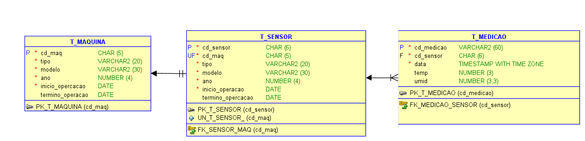

# FIAP - Faculdade de Informática e Administração Paulista

<p align="center">
<a href= "https://www.fiap.com.br/"></a>
</p>

<br>

# FarmTech na era da cloud computing

## Nome do grupo

## 👨‍🎓 Integrantes: 
- <a href="https://www.linkedin.com/in/arthur-alentejo">Arthur Guimarães Alentejo</a>
- <a href="https://www.linkedin.com/in/michaelrodriguess">Michael Rodrigues</a>
</a> 
- <a href="https://www.linkedin.com/in/nathalia-vasconcelos-18a390292/">Nathalia Vasconcelos</a> 

## 👩‍🏫 Professores:
### Tutor(a) 
- <a href="https://www.linkedin.com/company/inova-fusca">Lucas Gomes Moreira</a>
### Coordenador(a)
- <a href="https://www.linkedin.com/company/inova-fusca">Andre Godoi</a>

## 📜 Descrição



## 🤖 Pilar 2: Banco de Dados e Machine Learning

Nesta fase, o projeto foi estruturado em duas frentes: a modelagem de um banco de dados relacional para armazenar os dados dos sensores e o desenvolvimento de uma pipeline de Machine Learning para prever a temperatura das máquinas.

Nesta seção, desenvolvemos uma pipeline de Machine Learning para prever a temperatura dos sensores das máquinas com base em dados operacionais. O objetivo é criar um modelo preditivo que possa, no futuro, ser usado para detecção de anomalias e manutenção preditiva.

### Pipeline do Projeto

O projeto foi estruturado em três scripts principais, localizados em `src/ml/`:

1.  **`generate_data.py`**: Gera um conjunto de dados sintético para simular o ambiente real.
2.  **`run_eda.py`**: Realiza uma análise exploratória para entender a distribuição e as características dos dados, salvando gráficos em `src/ml/reports/figures/`.
3.  **`train_model.py`**: Prepara os dados, treina um modelo `RandomForestRegressor`, avalia seu desempenho e salva o artefato final em `src/ml/models/`.

### Modelagem do Banco de Dados

A estrutura do banco de dados foi definida em um Diagrama Entidade-Relacionamento (DER), localizado em `assets/DER_Reply.png`. O script para a criação das tabelas (`CREATE TABLE`) está disponível em `document/sql/schema.sql`.

### Justificativa da Escolha do Modelo

Para a tarefa de prever a temperatura (um problema de regressão), foi escolhido o algoritmo **RandomForestRegressor**. Os motivos para essa escolha são:

-   **Alta Performance**: É um modelo de *ensemble* (combinação de várias árvores de decisão) que geralmente oferece alta precisão sem a necessidade de um ajuste complexo de hiperparâmetros, sendo ideal para uma primeira abordagem robusta.
-   **Robustez**: É menos sensível a outliers em comparação com modelos lineares simples, o que é uma vantagem ao lidar com dados de sensores.
-   **Não-linearidade**: Consegue capturar relações complexas e não-lineares entre as features (como tipo de sensor, modelo, etc.) e a temperatura, o que é comum em sistemas físicos.

### Resultados do Modelo de Machine Learning

O modelo treinado alcançou um excelente desempenho na tarefa de prever a temperatura, com as seguintes métricas (valores aproximados):

-   **Mean Squared Error (MSE)**: Próximo de 0.08
-   **R² Score**: Aproximadamente 0.99

Um **R² Score** tão próximo de 1 indica que o modelo é extremamente preciso e consegue explicar 99% da variabilidade dos dados, validando a abordagem escolhida.

A performance do modelo pode ser visualizada no gráfico abaixo, que compara os valores reais de temperatura com os valores previstos pelo modelo. A concentração dos pontos ao longo da linha diagonal vermelha (que representa a "previsão perfeita") demonstra a alta acurácia do modelo.


### Como Executar o Projeto

1.  **Pré-requisitos**: Certifique-se de ter o Python 3 e o `pip` instalados. Crie e ative um ambiente virtual:
    ```bash
    python -m venv .venv
    source .venv/bin/activate  # No Windows: .venv\Scripts\activate
    ```

2.  **Instalar Dependências**:
    ```bash
    pip install -r requirements.txt
    ```

3.  **Executar a Pipeline de ML**: Navegue até a pasta `src/ml` e execute os scripts na ordem:
    ```bash
    cd src/ml
    python generate_data.py   # 1. Gera os dados
    python run_eda.py         # 2. Roda a análise e salva os gráficos
    python train_model.py     # 3. Treina e salva o modelo
    ```

### 🎥 Vídeo de Apresentação

Assista ao vídeo de 5 minutos que explica o projeto em detalhes:

**[Link para o vídeo no YouTube (Não Listado)]**


## 📁 Estrutura de pastas

Dentre os arquivos e pastas presentes na raiz do projeto, definem-se:

- <b>.github</b>: Nesta pasta ficarão os arquivos de configuração específicos do GitHub que ajudam a gerenciar e automatizar processos no repositório.

- <b>assets</b>: aqui estão os arquivos relacionados a elementos não-estruturados deste repositório, como imagens.

- <b>config</b>: Posicione aqui arquivos de configuração que são usados para definir parâmetros e ajustes do projeto.

- <b>document</b>: aqui estão todos os documentos do projeto que as atividades poderão pedir. Na subpasta "other", adicione documentos complementares e menos importantes.

- <b>scripts</b>: Posicione aqui scripts auxiliares para tarefas específicas do seu projeto. Exemplo: deploy, migrações de banco de dados, backups.

- <b>src</b>: Todo o código fonte criado para o desenvolvimento do projeto ao longo das 7 fases.

- <b>README.md</b>: arquivo que serve como guia e explicação geral sobre o projeto (o mesmo que você está lendo agora).

## 🔧 Como executar o código


## 🗃 Histórico de lançamentos

* 0.1.0 - 28/08/2025
    *

## 📋 Licença

<p xmlns:cc="http://creativecommons.org/ns#" xmlns:dct="http://purl.org/dc/terms/"><a property="dct:title" rel="cc:attributionURL" href="https://github.com/agodoi/template">MODELO GIT FIAP</a> por <a rel="cc:attributionURL dct:creator" property="cc:attributionName" href="https://fiap.com.br">Fiap</a> está licenciado sobre <a href="http://creativecommons.org/licenses/by/4.0/?ref=chooser-v1" target="_blank" rel="license noopener noreferrer" style="display:inline-block;">Attribution 4.0 International</a>.</p>


